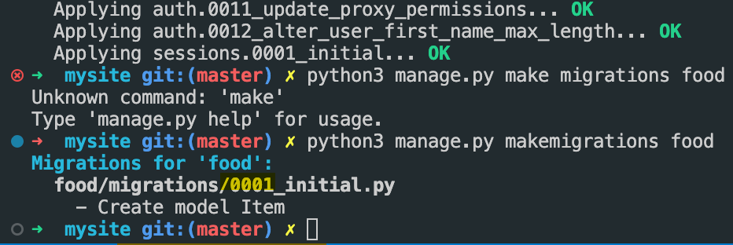

## Run application
    python3 manage.py runserver

## Apply migrations (create tables)
    python3 manage.py migrate

## Tell Django you have made changes to DB model
    python3 manage.py makemigrations <app name>
    python3 manage.py makemigrations food

## Sample Output

## Create the actual table referenced above
    python3 manage.py sqlmigrate food 0001 # (notice this was provided by django)

