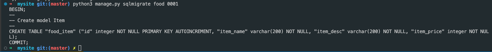
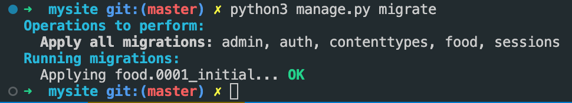

## Run application
    python3 manage.py runserver

 

## Create Super User for Admin Panel:
    python3 manage.py createsuperuser    

## Interacting with database shell
    python3 manage.py shell
    from food.models import Item <-- import our db model
    Item.objects.all() <-- list all items stored in item table
    a = Item(item_name="Pizza", item_desc="Cheesy Pizza", item_price=20) <-- create an item object
    a.save() <-- store object in DB

## Steps To Apply Migrations -e.g. creating tables (3):
    python3 manage.py migrate

### 1. Tell Django you have made changes to DB model
    python3 manage.py makemigrations <app name>
    python3 manage.py makemigrations food
### >>

### 2. Create the actual table referenced above
    python3 manage.py sqlmigrate food 0001 
    # notice the 0001 was provided by django
### >>    

### 3. Apply migrations
    python3 manage.py migrate
### >>

